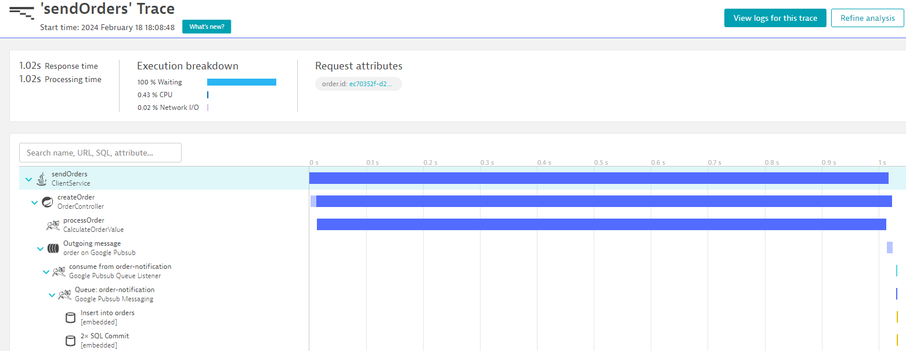

# Exemplo de integração usando Dynatrace e PUBSUB.

Para esse exemplo foi utilizado o SDK Java do OneAgent [OneAgent](https://github.com/Dynatrace/OneAgent-SDK-for-Java)

### Como Utilizar

Deve ser criado um ambiente de teste do Dynatrace utilizando a opção de Trial pelo seguinte [Link](https://www.dynatrace.com/signup/).

Após Criação do ambiente criar o Token para utilização do OneAgent no ambiente Linux e tecnologia Java.


Após selecionar a plataforma Linux gerar o Token para integração.


Tanto o Token como o enviromentId que seja encontra na URL devem ser incluídos no arquivo .env.

Exemplo com enviromentId pav53908 : https://pav53908.apps.dynatrace.com/ 

```dockerfile 
DYNATRACE_ENVIRONMENT=pav53908
DYNATRACE_TOKEN=<TOKEN>

```

### Request Attributes

Para que os Request Attributes sejam capturados pelo Dynatrace é necessários cadastra-los no Dynatrace da seguinte forma.


Os seguintes Request Attributes devem ser cadastrados:


Todos com a seguintes configuração:


Atenção para o source que sempre deve ser SDK custom attribute.


### Rodar o projeto

O projeto utiliza Docker e Docker compose para iniciar, deve ser rodado o comando:


```bash 
docker compose up

```
### Arquitetura

O projeto irá iniciar diversas chamadas REST e Assincronas utilizando o Emulador do PUBSUB e os traces serão enviados para o Dynatrace. 
No Menu Distribute Traces do Dynatrace é possível acompanhar os traces enviados como no exemplo abaixo:


